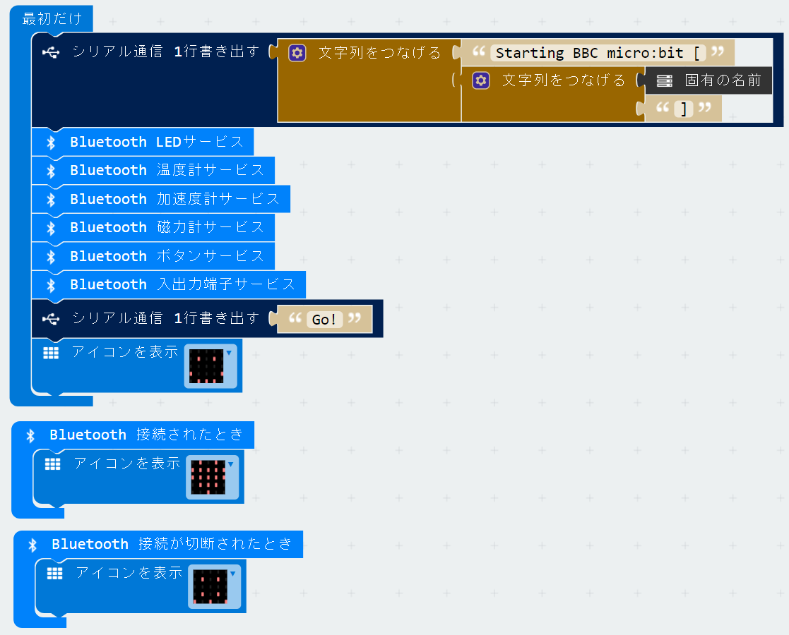
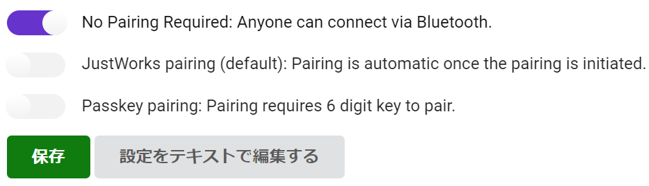
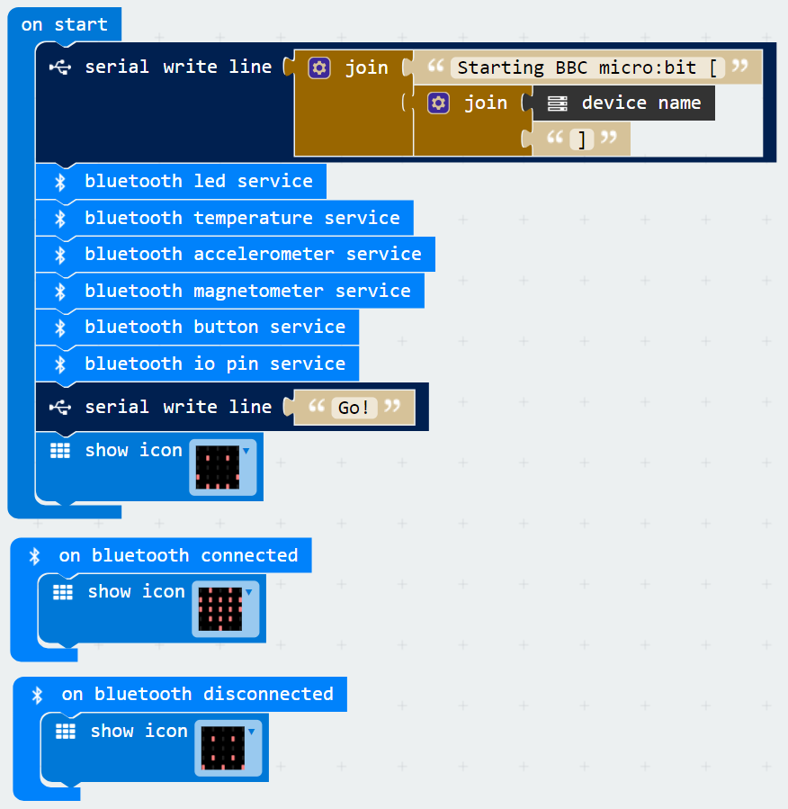

[(English)](#English)

 
# HEX ファイルのインストール
 
s2microbit-ble を使う場合は、はじめにUSBケーブルを使って micro:bit をPCに接続し、[このHEXファイル](microbit-scratch-extension2.hex)をコピーしておきます。
- HEXファイルのリンクで右クリックを押し「名前を付けてリンク先を保存」などを選ぶと保存できます。
- HEXファイルを micro:bit に転送すると、「DRAW A CIRCLE」とLED部分にスクロール表示されることがあります。
    - その場合は micro:bit を傾けながら、LED のドットが端の方を一周するように（ドットが円を描くように）動かします。

（参考）MakeCode で以下のプログラムを使って作成しました。

--- 

<a name="English">

# HEX file installation

Copy this HEX file to your micro:bit. This HEX file was generated by MakeCode with the following program.

