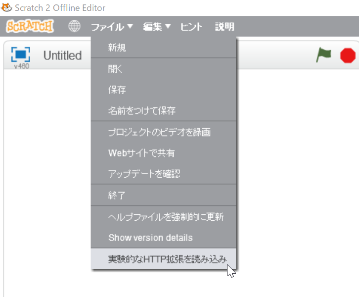

[(English)](#English)

# デモプロジェクト (.sb2) とブロック拡張ファイル (.s2e)

## Scratch 2 (Offline) プロジェクトファイル (.sb2)

- [豆猫 (cat.sb2)](cat.sb2)
    - 加速度センサでスクラッチキャットを動かします。
    - X, Y方向の値で位置、z方向が大きさに対応しているので、micro:bitをひっくり返すと猫が大きくなります。
- [飛ぶ (fly.sb2)](fly.sb2)
    - 四角の中を飛びます。micro:bit を、USB端子側を奥にして水平に持ち、飛行機のようにゆっくりと動かしてください。
    - あえて激しく動かすと、波紋っぽくなります。（その場合、四角を丸に変えるのもありかもしれません。）
    - 音楽: [魔王魂](https://maoudamashii.jokersounds.com/)より
- [いろいろ (small-tests.sb2)](small-tests.sb2)
    - いろいろなテストです。
    - [ブロックの使い方の解説](https://github.com/memakura/s2microbit-ble/wiki)で使っているプログラムが含まれています。

## Scratch 2 拡張ファイル (.s2e)

上記のデモプロジェクトではなく、新たに作成したプロジェクトや、以前に作成していたプロジェクトにs2microbit-bleのブロックを追加するときは、以下の Scratch 2 拡張ファイルを使います。

- [s2microbit_JA.s2e](s2microbit_JA.s2e)
    - 右クリックを押して「名前を付けてリンク先を保存」などを選び、自分のPCにダウンロードしてください。
    - Scratch 2 オフラインエディタで、シフトを押しながらメニューから**ファイル**を選び、「実験的なHTTP拡張を読み込み」を選んで、ダウンロードした s2e ファイルを読み込みます。

---

<a name="English">

# Demo projects (.sb2) and block extension files (.s2e)

## Scratch 2 (Offline) Project files (.sb2)

- [cat_EN.sb2](cat_EN.sb2)
    - Cat can be moved using accelerometer.
- [fly_EN.sb2](fly_EN.sb2)
    - Fly in the infinit loop of squares. 
    - Music: Thanks to [Maoudamashii](https://maoudamashii.jokersounds.com/).
- [small-tests_EN.sb2](small-tests_EN.sb2)
    - A set of simple test codes.

## Scratch 2 extension files (.s2e)

- [s2microbit_EN.s2e](s2microbit_EN.s2e)
    - A block extension file can be loaded from File menu. Choose **File** with `Shift` key pressed. Then choose **Import experimental HTTP extension**.
