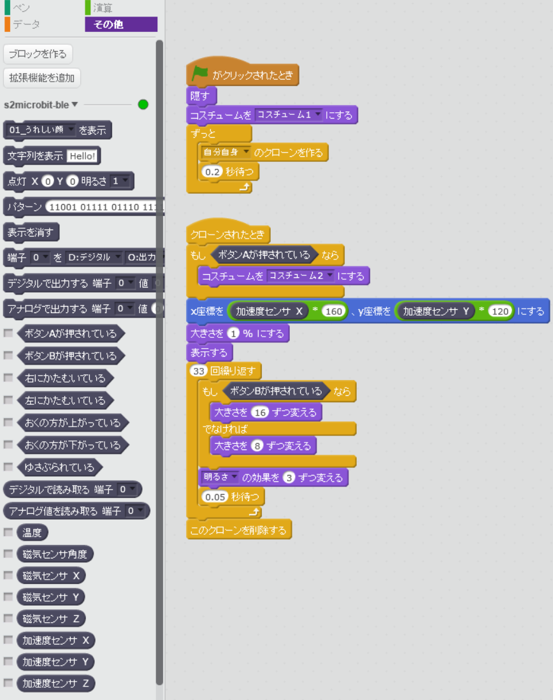
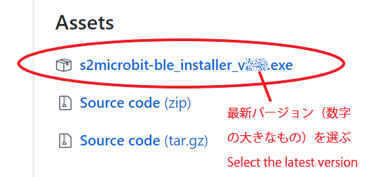
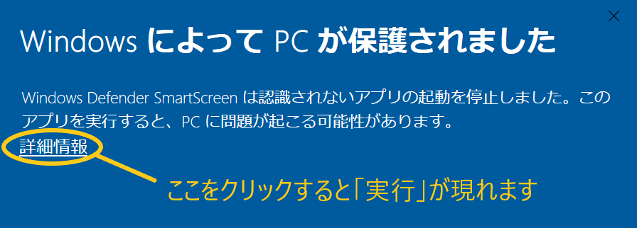
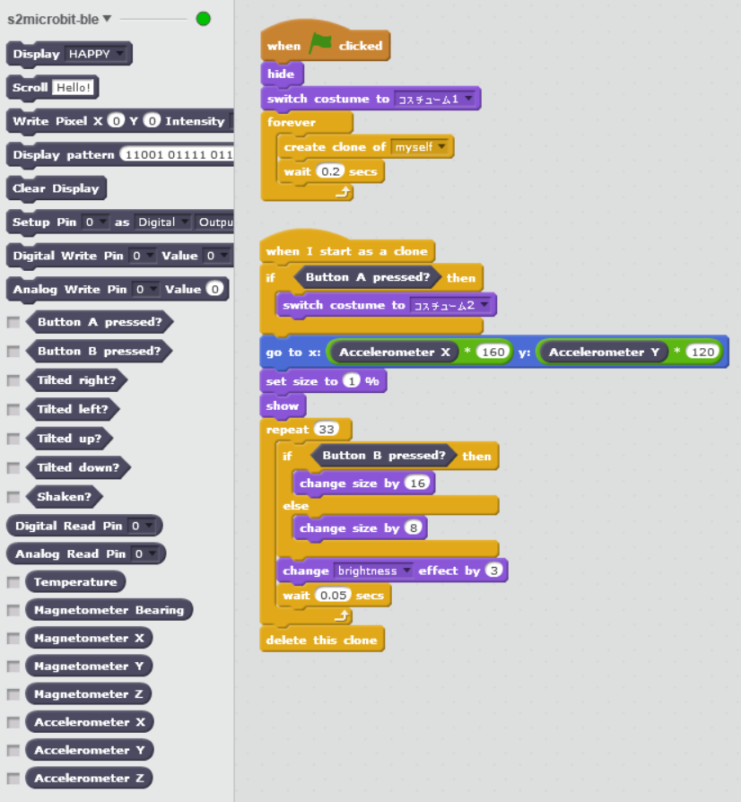

[(English)](#English)

# s2microbit-ble

BBC micro:bit を Scratch 2 オフライン版から Bluetooth 接続で使うための拡張ブロック

- **ブロックの使い方**: 下のアイコンをクリックしてください。
- **準備やインストール方法**：このページの[下の方](#Preparation_JA)をみてください。

<iframe width="500" height="281" align="right" src="https://www.youtube.com/embed/dTPiU2RnBIc" frameborder="0" allow="autoplay; encrypted-media" allowfullscreen></iframe>

<a name="Preparation_JA">

## 準備

1. Bluetooth 4.0 以上に対応した PC（なければ USBのBluetoothアダプタなどが使えます。）
1. Windows 10 build 10.0.15063 以上（OSビルド 15063以上）
    - Windows の画面左下の「ここに入力して検索」に winver といれ、リターンを押すと確認できます。
    - バージョンが古い場合は Windows をアップデートしておきます。
1. Microsoft Visual C++ 2015 再頒布可能パッケージをインストールしておきます。
    - [ここから](https://www.microsoft.com/ja-jp/download/details.aspx?id=52685)ダウンロードできます。
    - 多くの場合 Windows 10 (64bit) なので、その場合は vc_redist.x64.exe を選びます。
    - すでに入っている場合は不要です。よくわからない場合は先に進んで、もしエラーが起きたらこれを入れてください。
1. Windows のファイル拡張子を表示するようにしておくと便利です。
    - ファイルエクスプローラーで「表示」>「ファイル名拡張子」にチェックしておきます。

<a name="Installation_JA">

## インストール方法

1. [この Release ページ](https://github.com/memakura/s2microbit-ble/releases) から最新バージョンをダウンロード、インストールします。
    - s2microbit-ble_installer-v(バージョン番号).exe という名前です。 
    
    - 「Windows によって PC が保護されました」と出た場合は「詳細情報」をクリックしてから「実行」を選びます。 
    
1. インストールした s2microbit-ble を立ち上げておきます。
    - インストール完了時にはデフォルトではそのまま立ち上がります。
    - 二回目以降は、デスクトップのアイコンから立ち上げるか、Windows のタスクバー右下の「ここに入力して検索」に s2mi.. あたりまで入れると選べます。
    - 「The specified module could not be found」というエラーが出る場合は、準備のところで説明した再頒布可能パッケージが入っていない可能性があります。
1. [このページ](./00scratch) からScratch2のサンプルプロジェクトをダウンロードして開きます（例えば [fly.sb2](./00scratch/fly.sb2)など）。
1. [このページ](./00microbit)にある[HEXファイル](./microbit-scratch-extension2.hex)をダウンロードしてmicro:bitへ転送しておきます。
    - HEXファイルのリンクで右クリックを押し「名前を付けてリンク先を保存」などを選ぶと保存できます。
    - HEXファイルを micro:bit に転送すると、「DRAW A CIRCLE」とLED部分にスクロール表示されることがあります。その場合は micro:bit を傾けながら、LED のドットが端の方を一周するように（ドットが円を描くように）動かします。
1. 接続の確認
    - micro:bit とPCがすでにペアリング済みの場合、ペアリングは解除しておきます（ペアリングなしで接続するため）。
    - s2microbit-ble が立ち上がっていると自動で接続されます。"Console" というタブ（"Elements" の右）をクリックすると、メッセージや進行状況が表示されます。
    - micro:bit の LEDマトリクスが「ハート」を経て「チェックマーク」に変われば接続完了です。
    - Scratch 2 エディタの「その他」ブロックの s2microbit-ble という文字の横にある赤丸が緑丸になっていれば s2microbit-ble と Scratch 2 が接続できています。
    - [こちらのWiki](https://github.com/memakura/s2microbit-ble/wiki)も確認してみてください。

## サンプルプログラム (fly.sb2)

- 飛行機のような感じで動かしてください。
- AやBボタンを押している間、何か起こります。（A: Air, B: Bダッシュ）
- 動作デモは[この記事](https://qiita.com/memakura/items/1acab55a37651e9081b4)や[動画](https://www.youtube.com/embed/dTPiU2RnBIc)で確認できます。
- その他のサンプルプログラムは[こちらのページ](./00scratch)にあります。

<a name="StartProject_JA">

## 新たに Scratch 2 プロジェクトを作る場合

以下の二つのうちどちらかで行います。

- サンプルプログラムを元にプログラム作っていき「名前をつけて保存」で別の名前にします。
- 拡張ブロック用のファイル[s2microbit_JA.s2e](./00scratch/s2microbit_JA.s2e)を[00scratch](./00scratch)からダウンロードしておきます。新たにプロジェクトを作成し、シフトを押しながら「ファイル」>「実験的なHTTP拡張を読み込み」でダウンロードしたファイルを選ぶと拡張ブロックが追加されます。

## 注意点

- ペアリングは不要です。逆にペアリングされているとうまく接続できないかもしれません。その場合はペアリングを削除してみてください。
- 最初に見つかった micro:bit と接続します。電源の入った他の micro:bit が近くにあると、うまく接続できないかもしれません。
- Scanning... などの途中で止まる可能性もあります。以下を試してみてください。
    - s2microbit-ble を一度落として立ち上げ直す。
    - micro:bit のリセットボタンを押す。
    - micro:bit の一度電池を外して入れなおす。

## s2m との違い

多くのブロックは [MrYsLab の s2m](https://github.com/MrYsLab/s2m) と互換性があり、s2m 用のプロジェクトがそのまま動く部分もありますが、一方で、特に以下の点は大きく異なります。

- LED の明るさは段階的に指定できない（点灯か消灯かのみ）。
- アナログピンの値は 0-1023 ではなく、0-255 の範囲。

また、文字列をスクロールしたあとは、スクロール前のLEDパターンに戻るようになっています（ここの仕様は変わるかもしれません）。

## 改造方法

- s2microbit-ble は [Github のリポジトリ](https://github.com/memakura/s2microbit-ble)を clone して改造できます。
- 全体のシステム構成は、図で書くと[こんな感じ](./images/system-configuration.png)で、詳しくは[こちらの記事](https://qiita.com/memakura/items/1acab55a37651e9081b4)で解説しています。
- s2microbit-ble では Electron という仕組みを使っています。インストーラを生成する方法など、詳しくは[こちらの記事](https://qiita.com/memakura/items/dc5cf2ff39d24ceb53ff)が参考になります。
- もう少しシンプルなバージョンは [s2microbit-ble-console](https://github.com/memakura/s2microbit-ble-console) にあり、使用方法は[こちらの記事](https://qiita.com/memakura/items/11a0426f9060da1ded7e)が参考になります。

## 参考URL

このプログラムを作るうえで以下のコードやモジュールを参考にしたり、一部利用したりしています。

- [https://github.com/sandeepmistry/node-bbc-microbit](https://github.com/sandeepmistry/node-bbc-microbit)
- [https://github.com/jasongin/noble-uwp](https://github.com/jasongin/noble-uwp)
- [https://github.com/jaafreitas/scratch-microbit-extension](https://github.com/jaafreitas/scratch-microbit-extension)
- [https://github.com/MrYsLab/s2m](https://github.com/MrYsLab/s2m)

## ライセンス情報

- GPL 3.0

---

<a name="English">

# s2microbit-ble

Scratch 2 (offline) extension for BBC micro:bit bluetooth connection

## Requirements

1. Bluetooth 4.0 or later
1. Windows 10 build 10.0.15063 or later
1. Microsoft Visual C++ 2015 Redistributable

## Installation

1. Download and install the latest version from [Release](https://github.com/memakura/s2microbit-ble/releases).
    - For Windows: s2microbit-ble_installer.exe
1. Download and open a demo project (e.g., [fly_EN.sb2](./00scratch/fly_EN.sb2)) from [00scratch](./00scratch).
    - For English blocks: Download and open [s2microbit_EN.s2e](./s2microbit_EN.s2e) from Scratch 2 Offline Editor to overwrite the original language (open "File" menu with `Shift` key pressed).
1. Download [a firmware hex file](./00microbit/microbit-scratch-extension2.hex) from [this page](./00microbit) and write it to your micro:bit.
1. If the micro:bit has already been paired with the PC, Remove the pairing information.

## Demo: fly_EN.sb2

- Move your micro:bit like a plane.
- Press A or B button for some change.

## Difference from s2m

Many blocks are compatible with [s2m by MrYsLab](https://github.com/MrYsLab/s2m). Some projects with s2m blocks may work to some extent. However, the following difference should be noted.

- Intensity of the LEDs can only take binary values (ON or OFF).
- The value range of analog I/O pin is NOT 0-1023 but 0-255. 

## References

- [https://github.com/sandeepmistry/node-bbc-microbit](https://github.com/sandeepmistry/node-bbc-microbit)
- [https://github.com/jasongin/noble-uwp](https://github.com/jasongin/noble-uwp)
- [https://github.com/jaafreitas/scratch-microbit-extension](https://github.com/jaafreitas/scratch-microbit-extension)
- [https://github.com/MrYsLab/s2m](https://github.com/MrYsLab/s2m)

## License

- GPL 3.0
