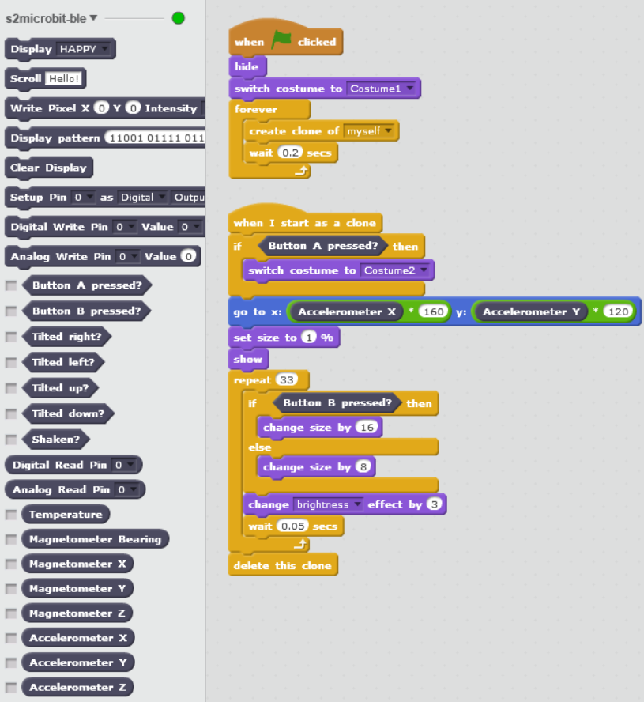

[(English version)](#English)

# s2microbit-ble

BBC micro:bit（マイクロビット）を、Scratch（スクラッチ）2 オフライン版から Bluetooth 接続で使うための拡張ブロックです。USBケーブルの接続であれば[s2m](https://github.com/MrYsLab/s2m)が使えるのですが、同じようなブロックを、PC内臓のBluetoothで使いたいので作成しました。予想以上に楽しいものが作れそうなのでここで共有します。

## インストーラのダウンロード (v2.4.1)

- [Windows 10](https://github.com/memakura/s2microbit-ble/releases/download/v2.4.1/s2microbit-ble_installer_v241.exe)
- [Mac OS X](https://github.com/memakura/s2microbit-ble/releases/download/v2.4.1/s2microbit-ble_installer_v241.dmg)
- **準備やインストール方法**：[このページの下の方](#Preparation_JA)をみてください。
- **ブロックの使い方**: [こちらのページで](https://github.com/memakura/s2microbit-ble/wiki)ブロックの使い方について説明しています。下のアイコンをクリックしてもOKです。

## 特徴

- s2mと同じようなブロックに加え、加速度センサなどの値を直接読めるブロックも用意したので、たとえばScratch2の無線ゲームコントローラを簡単に作成することもできます。
- 別途 Python や NodeJS といった環境を準備する必要はありません。
- インストーラ（Windowsでは加えてVC++再頒布パッケージ）のダウンロード以外では、ネットワーク接続は不要です。使用時にブロックのヘルプは読めなくなりますが・・・
- 特定のUSB Bluetooth アダプタは必要なく、Bluetooth 4.0以上のアダプタがPCに内臓されていれば、もしくは汎用のUSB Bluetooth（4.0以上）のアダプタがあれば（多くの場合？）接続できます。その代わり Windows版は Windows 10 のみの対応（2017年4月ぐらいまでのアップデートが必要）です。
- 現在は Windows 10 と Mac OS X のみですが、おそらく Linux版のビルドも可能です。

<iframe width="356" height="200" margin-bottom="4" margin-left="5" src="https://www.youtube.com/embed/dTPiU2RnBIc?rel=0" frameborder="0" allow="autoplay; encrypted-media" allowfullscreen></iframe>

<a name="Preparation_JA">

## 準備

Bluetooth 4.0 以上を内蔵した PC か USB等のBluetoothアダプタが必要です。Windows の場合は以下も確認してください。

1. Windows 10 build 10.0.15063 以上（OSビルド 15063以上）
    - Windows の画面左下の「ここに入力して検索」に winver といれ、リターンを押すと確認できます。
    - バージョンが古い場合は Windows をアップデートしておきます。
1. [Microsoft Visual C++ 2015 再頒布可能パッケージ](https://www.microsoft.com/ja-jp/download/details.aspx?id=52685)をインストールしておきます。
    - 上のリンクからダウンロードできます。
    - 多くの場合 Windows 10 (64bit) なので、その場合は vc_redist.x64.exe を選びます。
    - すでに入っている場合は不要です。よくわからない場合は先に進んで、もしエラーが起きたらこれを入れてください。
1. Windows のファイル拡張子を表示するようにしておくと便利です。
    - ファイルエクスプローラーで「表示」>「ファイル名拡張子」にチェックしておきます。

<a name="Installation_JA">

## インストール方法 (Windows)

1. [この Release ページ](https://github.com/memakura/s2microbit-ble/releases) から最新バージョンをダウンロード、インストールします。
    - s2microbit-ble_installer-v(バージョン番号).exe という名前です。 
      
    - 「Windows によって PC が保護されました」と出た場合は「詳細情報」をクリックしてから「実行」を選びます。 
      
1. インストールした s2microbit-ble を立ち上げておきます。
    - インストール完了時にはデフォルトではそのまま立ち上がります。
    - 二回目以降は、デスクトップのアイコンから立ち上げるか、Windows のタスクバー右下の「ここに入力して検索」に s2mi.. あたりまで入れると選べます。
    - 「The specified module could not be found」というエラーが出る場合は、準備のところで説明した再頒布可能パッケージが入っていない可能性があります。

## インストール方法 (Mac)

1. [この Release ページ](https://github.com/memakura/s2microbit-ble/releases) から最新バージョンをダウンロード、インストールします。
    - s2microbit-ble_installer-v(バージョン番号).dmg という名前です。
    - dmg を実行し、s2microbit-ble のアイコンを Applications（アプリケーション）フォルダのアイコンにドラッグアンドドロップします。
1. Finderから「アプリケーション」フォルダを開き、Control キーを押しながら s2microbit-ble のアイコンをクリックして「開く」を選びます。
    - 初回は「"s2microbit-ble"はインターネットからダウンロードされたアプリケーションです。開いてもよろしいですか？」という警告がでます。

## 使い方

1. [こちらのWiki](https://github.com/memakura/s2microbit-ble/wiki)も確認してみてください。
1. s2microbit-ble の画面からScratch2のサンプルプロジェクトをダウンロードして開きます
    - [このページ](./00scratch)からもダウンロードできます。（例えば [fly.sb2](./00scratch/fly.sb2)などのように、拡張子が sb2 になっています）。
1. s2microbit-ble の画面からHEXファイルをダウンロードしてmicro:bitへ転送しておきます。
    - [このページ](./00microbit)からも[HEXファイル](./00microbit/microbit-scratch-extension2.hex)をダウンロードできます。（「名前を付けてリンク先を保存」などを選ぶと保存できます。）
    - HEXファイルを micro:bit に転送すると、「DRAW A CIRCLE」とLED部分にスクロール表示されることがあります。その場合は micro:bit を傾けながら、LED のドットが端の方を一周するように（ドットが円を描くように）動かします。
1. 接続の確認
    - micro:bit とPCがすでにペアリング済みの場合、ペアリングは解除しておきます（ペアリングなしで接続するため）。
    - micro:bit に上記のHEXファイルが書き込まれていれば、s2microbit-ble が立ち上がったときに自動で接続されます。画面右側にメッセージや進行状況が表示されます。
    - このHEXファイルが書き込まれた micro:bit が2つ以上見つかると、いずれかをクリックして選択することができます。あらかじめ1台だけ見つかるようにして、アドレス（数字やアルファベットが2文字ずつコロンで区切られたもの）を調べておく必要があります。
    - micro:bit の LEDマトリクスが「ハート」を経て「チェックマーク」に変われば接続完了です。
    - Scratch 2 エディタの「その他」ブロックの s2microbit-ble という文字の横にある赤丸が緑丸になっていれば s2microbit-ble と Scratch 2 が接続できています。

## サンプルプログラム (fly.sb2)

- 飛行機のような感じで動かしてください。
- AやBボタンを押している間、何か起こります。（A: Air, B: Bダッシュ）
- 動作デモは[この記事](https://qiita.com/memakura/items/1acab55a37651e9081b4)や[動画](https://youtu.be/dTPiU2RnBIc)で確認できます。
- その他のサンプルプログラムは[こちらのページ](./00scratch)にあります。

<a name="StartProject_JA">

## 新たに Scratch 2 プロジェクトを作る場合

以下の二つのうちどちらかで行います。

- サンプルプログラムを元にプログラム作っていき「名前をつけて保存」で別の名前にします。
- 拡張ブロック用のファイル[s2microbit_JA.s2e](./00scratch/s2microbit_JA.s2e)を[00scratch](./00scratch)からダウンロードしておきます。新たにプロジェクトを作成し、シフトを押しながら「ファイル」>「実験的なHTTP拡張を読み込み」でダウンロードしたファイルを選ぶと拡張ブロックが追加されます。

## 注意点

- ペアリングは不要です。逆にペアリングされているとうまく接続できないかもしれません。その場合はペアリングを削除してみてください。
- 最初に見つかった micro:bit と接続します。電源の入った他の micro:bit が近くにあると、うまく接続できないかもしれません。
- scanning... などの途中で止まる可能性もあります。以下を試してみてください。
    - s2microbit-ble を一度落として立ち上げ直す。
    - micro:bit のリセットボタンを押す。
    - micro:bit の一度電池を外して入れなおす。

## s2m との違い

多くのブロックは [MrYsLab の s2m](https://github.com/MrYsLab/s2m) と互換性があり、s2m 用のプロジェクトがそのまま動く部分もありますが、一方で、特に以下の点は大きく異なります。

- LED の明るさは段階的に指定できない（点灯か消灯かのみ）。
- アナログピンの値は 0-1023 ではなく、0-255 の範囲。

また、文字列をスクロールしたあとは、スクロール前のLEDパターンに戻るようになっています（ここの仕様は変わるかもしれません）。

## 改造方法

- s2microbit-ble は [Github のリポジトリ](https://github.com/memakura/s2microbit-ble)を clone して改造できます。
- 全体のシステム構成は、図で書くと[こんな感じ](./images/system-configuration.png)で、詳しくは[こちらの記事](https://qiita.com/memakura/items/1acab55a37651e9081b4)で解説しています。
- s2microbit-ble では Electron という仕組みを使っています。インストーラを生成する方法など、詳しくは[こちらの記事](https://qiita.com/memakura/items/dc5cf2ff39d24ceb53ff)が参考になります。
- もう少しシンプルなバージョンは [s2microbit-ble-console](https://github.com/memakura/s2microbit-ble-console) にあり、使用方法は[こちらの記事](https://qiita.com/memakura/items/11a0426f9060da1ded7e)が参考になります。

## 参考URL

このプログラムを作るうえで以下のコードやモジュールを参考にしたり、一部利用したりしています。

- [https://github.com/sandeepmistry/node-bbc-microbit](https://github.com/sandeepmistry/node-bbc-microbit)
- [https://github.com/jasongin/noble-uwp](https://github.com/jasongin/noble-uwp)
- [https://github.com/jaafreitas/scratch-microbit-extension](https://github.com/jaafreitas/scratch-microbit-extension)
- [https://github.com/MrYsLab/s2m](https://github.com/MrYsLab/s2m)

## ライセンス情報

- [AGPL 3.0](LICENSE.txt)

### Copyright

- 拡張ブロックの一部は MrYsLab s2m 互換です。
    - s2m互換ブロックの日本語は[石原さんの翻訳](http://blog.champierre.com/1112)を参考にしています。
    - 英語ブロック名は s2m (Alan Yorinks) のものを利用させてもらっています。
- デモプロジェクトの音楽は"魔王魂"からです。
- Wikiでは一部"いらすとや"の画像を使わせてもらっています。

---

<a name="English">

# s2microbit-ble

Scratch 2 (offline) extension for BBC micro:bit bluetooth connection

## Requirements

1. Bluetooth 4.0 or later
1. Windows 10 build 10.0.15063 or later
1. Microsoft Visual C++ 2015 Redistributable

## Installation

1. Download and install the latest version from [Release](https://github.com/memakura/s2microbit-ble/releases).
    - For Windows: s2microbit-ble_installer.exe
1. Download and open a demo project (e.g., [fly_EN.sb2](./00scratch/fly_EN.sb2)) from [00scratch](./00scratch).
    - For English blocks: Download and open [s2microbit_EN.s2e](./s2microbit_EN.s2e) from Scratch 2 Offline Editor to overwrite the original language (open "File" menu with `Shift` key pressed).
1. Download [a firmware hex file](./00microbit/microbit-scratch-extension2.hex) from [this page](./00microbit) and write it to your micro:bit.
1. If the micro:bit has already been paired with the PC, Remove the pairing information.

## Demo project: fly_EN.sb2

- Move your micro:bit like a plane.
- Press A or B button for some change.
- More demo projects can be found in [this page](./00scratch).

## Difference from s2m

Many blocks are compatible with [s2m by MrYsLab](https://github.com/MrYsLab/s2m). Some projects with s2m blocks may work to some extent. However, the following difference should be noted.

- Intensity of the LEDs can only take binary values (ON or OFF).
- The value range of analog I/O pin is NOT 0-1023 but 0-255. 

## References

Some part of the following modules and codes are used or referred in this project.

- [https://github.com/sandeepmistry/node-bbc-microbit](https://github.com/sandeepmistry/node-bbc-microbit)
- [https://github.com/jasongin/noble-uwp](https://github.com/jasongin/noble-uwp)
- [https://github.com/jaafreitas/scratch-microbit-extension](https://github.com/jaafreitas/scratch-microbit-extension)
- [https://github.com/MrYsLab/s2m](https://github.com/MrYsLab/s2m)

## License

- [AGPL 3.0](LICENSE.txt)

## Copyright

- English names of s2m-compatible blocks are the same as those in s2m by MrYsLab (Alan Yorinks).
